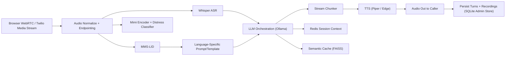

# A Low-Cost AI Voice Agent for Indic Languages with Integrated Voice Analysis

> Research-grade, production-oriented speech-to-speech stack for multilingual Indic voice interaction with safety-aware acoustic analysis.

This repository contains the implementation and deployment assets for the system described in your paper (`updated-s2s.pdf`): a self-hosted, low-cost, multilingual voice AI pipeline for Indian languages with integrated emergency/distress detection from raw voice acoustics.

## Table of Contents

1. [Project Summary](#project-summary)
2. [Why This Work Matters](#why-this-work-matters)
3. [Core Contributions](#core-contributions)
4. [System Architecture](#system-architecture)
5. [Runtime Pipeline](#runtime-pipeline)
6. [Measured Performance (Paper Metrics)](#measured-performance-paper-metrics)
7. [Cost Model and Economic Viability](#cost-model-and-economic-viability)
8. [Language Coverage and Expansion Strategy](#language-coverage-and-expansion-strategy)
9. [Repository Structure](#repository-structure)
10. [Quick Start (Local)](#quick-start-local)
11. [Run with Docker](#run-with-docker)
12. [DigitalOcean MI300X Deployment](#digitalocean-mi300x-deployment)
13. [Frontend and Interaction Endpoints](#frontend-and-interaction-endpoints)
14. [API Surface](#api-surface)
15. [Admin Panel and Agent Runtime](#admin-panel-and-agent-runtime)
16. [Voice Analysis and Safety Escalation](#voice-analysis-and-safety-escalation)
17. [Benchmarking and Reproducibility](#benchmarking-and-reproducibility)
18. [Current Constraints / Threats to Validity](#current-constraints--threats-to-validity)
19. [Future Roadmap (from Paper)](#future-roadmap-from-paper)
20. [Citation](#citation)
21. [License](#license)

## Project Summary

This system is designed for **real-time multilingual voice interaction** in Indic-language contexts where cost, latency, and accessibility are primary constraints.

The implementation combines:

- **Audio ingress**: WebRTC (browser) + Twilio Media Streams (telephony)
- **Language ID**: MMS-LID (`facebook/mms-lid-256`)
- **ASR**: Whisper-small (`openai/whisper-small`)
- **LLM orchestration**: Ollama + `llama3.2:3b` + semantic cache (FAISS) + Redis session context
- **TTS**: Piper (local) with Edge TTS fallback
- **Voice analysis**: Mimi encoder + transformer classifier for distress/emergency cues

The paper reports:

- **Time-to-first-sound (TTFS)**: ~488 ms
- **End-to-end speech-to-speech latency**: ~742 ms
- **Operating cost target**: `< INR 2/min` (reported direct cost ~`INR 0.95/min`)
- **Commercial cost savings**: ~85-90%

## Why This Work Matters

Commercial voice AI for Indic languages is often priced too high for large-scale public deployment. This project addresses that gap with:

- Self-hosted open-source stack
- Native multilingual strategy (Hindi, Tamil, Telugu, Kannada, Tulu, English)
- Safety-aware parallel acoustic analysis (not text-only sentiment)
- Configurable runtime policies for domain adaptation

Target use cases include emergency response, telehealth triage, government services, and regional helpdesks.

## Core Contributions

Based on the paper, this work contributes:

1. **Low-cost production architecture** for multilingual Indic voice interaction.
2. **Parallel acoustic safety analysis** using Mimi embeddings + distress classifier.
3. **Deployment-ready pipeline** with WebRTC + telephony + observability endpoints.
4. **Transparent latency and cost accounting** from measured runs on AMD MI300X.
5. **Language expansion methodology** (validated with Tulu integration case study).

## System Architecture



### Design Principles Reflected in the Implementation

- Fail-safe over fail-silent behavior in uncertain/high-risk cases
- Bounded, swappable modules instead of monolithic e2e inference
- Multiple transport modes (streaming + upload fallback)
- Runtime policy separation via templates/agent profiles
- Measurement-first engineering with explicit reporting of failures

## Runtime Pipeline

Canonical call flow:

1. Audio arrives over WebRTC or Twilio websocket events.
2. Audio is normalized and buffered.
3. Energy/silence endpointing detects utterance boundaries.
4. LID and voice analysis execute in parallel windows.
5. Whisper transcribes completed utterance.
6. LLM layer generates response (with session context + semantic cache).
7. Response is chunked for speech-friendly streaming.
8. TTS synthesizes chunks incrementally.
9. Audio is sent back; turns/recordings are persisted.

Two serving modes are supported:

- **Streaming call mode** (`/offer`, media stream)
- **Single-turn upload mode** (`/voice-turn` and `/voice-turn-stream`)

## Measured Performance (Paper Metrics)

> Hardware context from paper: AMD Instinct MI300X (ROCm 7.1), measurements dated February 22, 2026.

### End-to-End Latency Budget

| Stage | Avg Latency (ms) |
|---|---:|
| VAD (energy-based) | 0.92 |
| Speech preprocessing | 0.74 |
| LID (MMS-LID) | 21.18 |
| ASR (Whisper-small FP16) | 99.63 |
| Semantic cache lookup (FAISS) | 1.04 |
| Mimi speech encoder | 14.74 |
| Emergency classifier | 15.16 |
| LLM TTFT (`llama3.2:3b`) | 176.83 |
| LLM full response (25 tokens) | 368.90 |
| TTS first chunk | 188.25 |
| TTS full synthesis (English Edge) | 251.04 |
| **TTFS (reported)** | **488** |
| **End-to-end (reported)** | **742** |

### LLM Chunking Trade-off (Paper)

| Chunk size (tokens) | First chunk (ms) | Inter-chunk (ms) | Avg chunk count |
|---:|---:|---:|---:|
| 1 | 176.83 | 3.98 | 48.2 |
| 4 | 188.25 | 15.20 | 12.6 |
| 8 | 203.81 | 28.83 | 6.6 |
| 16 | 235.41 | 51.12 | 3.6 |

Production choice in paper: **4-token chunking** as a practical balance.

### TTS Latency by Language (Paper)

| Language | Engine | Avg (ms) |
|---|---|---:|
| English | Edge fallback | 251.04 |
| Hindi | Edge fallback | 509.51 |
| Tamil | Piper native | 1623.41 |
| Telugu | Edge fallback | 374.22 |
| Kannada | Edge fallback | 317.85 |

## Cost Model and Economic Viability

### Reported Per-Minute Operating Cost

| Component | Cost (INR/min) | Share |
|---|---:|---:|
| SIP telephony | 0.50 | 53% |
| GPU compute (all models) | 0.35 | 37% |
| Infra + maintenance | 0.10 | 10% |
| **Total direct cost** | **0.95** | **100%** |

Paper pricing scenario:

- Target price: **INR 3.50/min**
- Direct cost: **INR 0.95/min**
- Gross margin: **~73%**

Commercial comparison (paper):

- Commercial: **INR 7-15/min**
- Proposed self-hosted: **INR 0.95-2.00/min**
- Savings: **~85-90%**

## Language Coverage and Expansion Strategy

### Current Target Languages

- Hindi
- Tamil
- Telugu
- Kannada
- Tulu
- English

### Expansion Workflow (from paper)

1. **Data collection/curation** for ASR, LID, TTS
2. **Parameter-efficient tuning** (e.g., LoRA adapters)
3. **Linguistic/cultural adaptation** (templates, honorifics, domain phrasing)
4. **Component + end-to-end validation** (WER, confidence, MOS, integration)

The paper’s Tulu case study reports a relative WER reduction and validates this pipeline for minority language onboarding.

## Repository Structure

```text
src/
  admin/                 # Admin storage/runtime profile logic
  llm/                   # Ollama client, semantic cache, prompt orchestration
  realtime/              # Flask signaling server, HTML clients, WebRTC/Twilio paths
  tts/                   # Piper + Edge TTS manager and setup scripts
  train/                 # Training scripts for emergency and embeddings
scripts/                 # Benchmarking + paper metric extraction utilities
deploy/                  # Nginx/systemd/bootstrap assets for deployment
paper/                   # Research artifacts and measured evidence snapshots
```

## Quick Start (Local)

### 1) Prerequisites

- Python 3.10+
- Ollama installed and running
- Redis running locally
- Optional GPU runtime (ROCm stack) for acceleration
- Outbound internet if using Edge TTS fallback

### 2) Install Dependencies

```bash
git clone <your-repo-url>
cd "solvathon_layer1-main 3"
python3 -m venv .venv
source .venv/bin/activate
pip install -r requirements.txt
python3 -m pip install piper-tts
```

### 3) Configure Environment

```bash
cp .env.example .env
```

Key values in `.env`:

- `OLLAMA_BASE_URL`
- `WHISPER_MODEL`
- `LID_MODEL`
- `TTS_BACKEND` (`auto`, `piper`, `edge`)
- `REDIS_HOST`, `REDIS_PORT`
- `DISTRESS_WINDOW`, `DISTRESS_MIN_HITS`, `EMERGENCY_THRESHOLD`

### 4) Prepare TTS Models

```bash
chmod +x src/tts/setup_piper.sh
./src/tts/setup_piper.sh
```

### 5) Pull LLM Models in Ollama

```bash
ollama pull llama3.2:3b
ollama pull llama3.2:1b
ollama pull nomic-embed-text
```

### 6) Run Server

```bash
python -m src.realtime.signaling_server
```

Server defaults to `http://localhost:8080`.

## Run with Docker

### Development Compose

```bash
docker compose -f docker-compose.dev.yml up --build -d
```

### Full Compose (with nginx)

```bash
docker compose up --build -d
```

Useful checks:

```bash
curl http://localhost:8080/healthz
curl http://localhost:8080/ready
curl http://localhost:8080/metrics
```

## DigitalOcean MI300X Deployment

A production-oriented setup is included for MI300X in:

- `DEPLOYMENT.md`
- `SPLIT_DEPLOYMENT.md`
- `deploy/do_gpu_bootstrap.sh`
- `deploy/solvathon.service`

Recommended flow:

1. Provision MI300X droplet with ROCm-ready image
2. Run bootstrap script (scratch mount + Docker)
3. Configure `.env` caches to scratch paths
4. Start via docker compose
5. Validate with `/healthz`, `/ready`, `/metrics`

## Frontend and Interaction Endpoints

- `/` or `/client`: default client UI
- `/call`: production call interface
- `/push-to-talk`: upload-based interface
- `/lid-test`: language ID testing UI
- `/admin`: admin panel

## API Surface

### Realtime and Ops

- `POST /offer` - WebRTC SDP offer/answer negotiation
- `POST /voice-turn` - single-turn speech upload -> synthesized reply JSON
- `POST /voice-turn-stream` - SSE streaming variant
- `POST /detect-lang` - direct LID endpoint
- `GET /ice-config` - ICE server config
- `GET /ready` - model readiness
- `GET /healthz` - health + dependencies
- `GET /metrics` - pipeline counters + latency summaries

### Admin APIs

- `GET/POST /admin/templates`
- `PUT /admin/templates/<id>`
- `GET/POST /admin/agents`
- `GET/PUT /admin/agents/<id>`
- `POST /admin/agents/<id>/activate`
- `GET /admin/active-agent`
- `GET /admin/conversations`
- `GET /admin/conversations/<id>`
- `GET /admin/recordings/<path>`

## Admin Panel and Agent Runtime

The admin runtime supports:

- template-driven response policy
- multiple configurable agents
- active-agent switching without code changes
- turn-level transcript and audio persistence

This allows domain adaptation (healthcare desk, education support, customer service, emergency intake) while preserving the same inference pipeline.

## Voice Analysis and Safety Escalation

Parallel safety path:

1. Mimi extracts acoustic representations.
2. Transformer classifier estimates distress probability.
3. Sustained distress logic triggers deterministic escalation/handover behavior.

Design intent:

- Use acoustic cues even when text appears neutral.
- Avoid purely free-form generation in high-risk contexts.
- Keep bounded handover behavior for safer operations.

## Benchmarking and Reproducibility

### Connectivity / Endpoint Validation

```bash
python test_pipeline.py --server http://localhost:8080
```

### Latency Benchmark Scripts

```bash
python scripts/component_latency_benchmark.py
python scripts/ollama_chunk_latency.py
python scripts/benchmark_faiss_lookup.py
python src/benchmark_mimi_latency.py
python src/benchmark_emergency_latency.py
```

### Paper Evidence Artifacts

See `paper/evidence_remote/` for saved result snapshots and reports used in paper analysis.

## Current Constraints / Threats to Validity

The paper explicitly notes practical constraints that still matter for production interpretation:

- Some checks are timeout-sensitive under strict client thresholds.
- Redis persistence/runtime hardening is needed for robust long-lived context.
- Several measurements were taken with small run counts (directional but not full-scale statistical characterization).
- Reported benchmarks are tied to specific hardware/runtime/model versions.

## Future Roadmap (from Paper)

1. **LLM optimization**: INT8/INT4 quantization + speculative decoding for lower TTFT.
2. **S2S decoder migration**: SNAC-style direct speech token generation to reduce TTS bottleneck.
3. **Language expansion**: add Bengali, Marathi, Malayalam, Gujarati, and more.
4. **Voice analysis rigor**: reproducible split manifests + larger multilingual evaluation.
5. **Load-tested economics**: concurrent-session benchmarks at production scales.

## Citation

If you use this repository in research, cite your paper:

```bibtex
@article{gangadhar2026lowcostindicvoice,
  title={A Low-Cost AI Voice Agent for Indic Languages with Integrated Voice Analysis},
  author={Gangadhar, Jeevith and Naik, Nagaraj},
  year={2026},
  note={Preprint / project manuscript}
}
```

## License

This repository contains a `LICENSE` file at the root. See it for usage terms.

---

### Important Safety Note

This system provides **decision support** and conversational assistance. It is **not** a certified medical or emergency dispatch device. High-risk or life-threatening scenarios must escalate to qualified human responders and official emergency channels.
