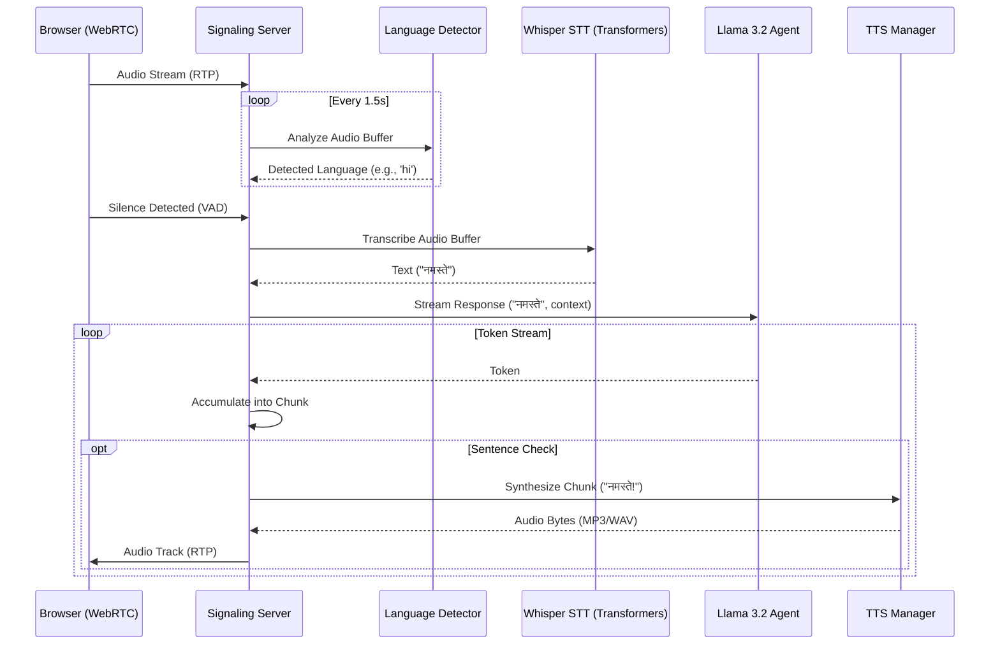

# Solvathon Layer 1 - Technical Manual

## 1. System Architecture

The system is a specific implementation of a **Voice-to-Voice AI** pipeline designed for low-latency emergency response.



---

## 2. Configuration Reference

Configuration is managed via **Global Constants** in `src/realtime/signaling_server.py`. To tune performance, modify these values at the top of the file.

### Audio Settings
| Constant | Default | Description |
|---|---|---|
| `SAMPLE_RATE` | `48000` | WebRTC audio sample rate (Hz). |
| `CHANNELS` | `1` | Audio channels (Mono). |
| `CHUNK_DURATION` | `1.5` | Duration (seconds) for Language Detection window. |
| `MIN_SPEECH_DURATION`| `1.0` | Minimum silence duration to trigger STT. |

### Emergency Detection
| Constant | Default | Description |
|---|---|---|
| `DISTRESS_WINDOW` | `10` | buffer size for distress analysis. |
| `MIN_HITS` | `3` | Number of positive detections to trigger "High Distress" mode. |

### Model Paths
| Constant | Default | Description |
|---|---|---|
| `OLLAMA_BASE_URL` | `http://localhost:11434` | URL for the local Ollama instance. |
| `WHISPER_MODEL` | `openai/whisper-small` | Path or name of the STT model. |

### Environment Variables
| Variable | Default | Description |
|---|---|---|
| `OLLAMA_BASE_URL` | `http://localhost:11434` | Ollama server URL. |
| `WHISPER_MODEL` | `openai/whisper-small` | Whisper model for STT. |
| `LID_MODEL` | `facebook/mms-lid-256` | MMS-LID model for language ID. |
| `TTS_BACKEND` | `auto` | `piper`, `edge`, or `auto`. |
| `PIPER_MODELS_DIR` | `src/tts/piper_models` | Piper model directory. |
| `EDGE_TTS_VOICE_TA` | `ta-IN-PallaviNeural` | Edge TTS voice for Tamil. |
| `EDGE_TTS_VOICE_KN` | `kn-IN-SapnaNeural` | Edge TTS voice for Kannada. |
| `EDGE_TTS_RATE` | `+0%` | Edge TTS speech rate. |
| `EDGE_TTS_VOLUME` | `+0%` | Edge TTS volume. |
| `EDGE_TTS_PITCH` | `+0Hz` | Edge TTS pitch. |
| `ENABLE_TWILIO` | `true` | Enable Twilio Media Streams. |
| `ENABLE_LID_AUTODETECT` | `true` | Server-side LID fallback. |
| `HANDOVER_MODE` | `phone` | `phone` or `kiosk` handover behavior. |

> **Note:** Edge TTS requires outbound internet access. If unavailable, the system falls back to Piper English.

---

## 3. API Reference

### WebRTC Signaling
The server uses HTTP POST for the initial handshake (SDP Exchange).

#### `POST /offer`
Initiates a WebRTC session.
- **Request Body**:
  ```json
  {
    "sdp": "v=0...",
    "type": "offer",
    "language": "eng" // Optional initial hint
  }
```
- **Response**:
  ```json
  {
    "sdp": "v=0...",
    "type": "answer"
  }
```

### Health & Metrics
- `GET /healthz` returns readiness and dependency status.
- `GET /metrics` returns JSON latency summaries and counters.

### Twilio Media Streams
`wss://<host>/media-stream`
- Incoming events: `start`, `media`, `stop`
- Outgoing events: `media` (μ-law 8kHz)

---

## 4. Troubleshooting & FAQ

### 1. "Piper binary not found" / `127` Error
- **Cause**: The `setup_piper.sh` script failed or wasn't run.
- **Fix**:
  1. Ensure `src/tts/setup_piper.sh` is executable: `chmod +x src/tts/setup_piper.sh`
  2. Run it: `./src/tts/setup_piper.sh`
  3. If on macOS arm64, ensure `piper-tts` pip package is installed as a fallback.

### 2. "LibreSSL/OpenSSL Warning"
- **Cause**: macOS system Python uses LibreSSL, while `urllib3` prefers OpenSSL.
- **Impact**: Usually harmless.
- **Fix**: Ignore, or install Python via Homebrew (`brew install python`) to use OpenSSL.

### 3. "IndicF5 Not Available"
- **Cause**: Missing IndicF5 model or reference clips.
- **Fix**: Add `ta.wav` and `kn.wav` to `models/indicf5_refs` and ensure the model is available.

### 4. Browser hears no audio
- **Cause**: WebRTC Auto-play policy.
- **Fix**: Ensure you have interacted with the page (clicked "Start") *before* the server sends audio. Chrome blocks audio from hidden/inactive tabs.
